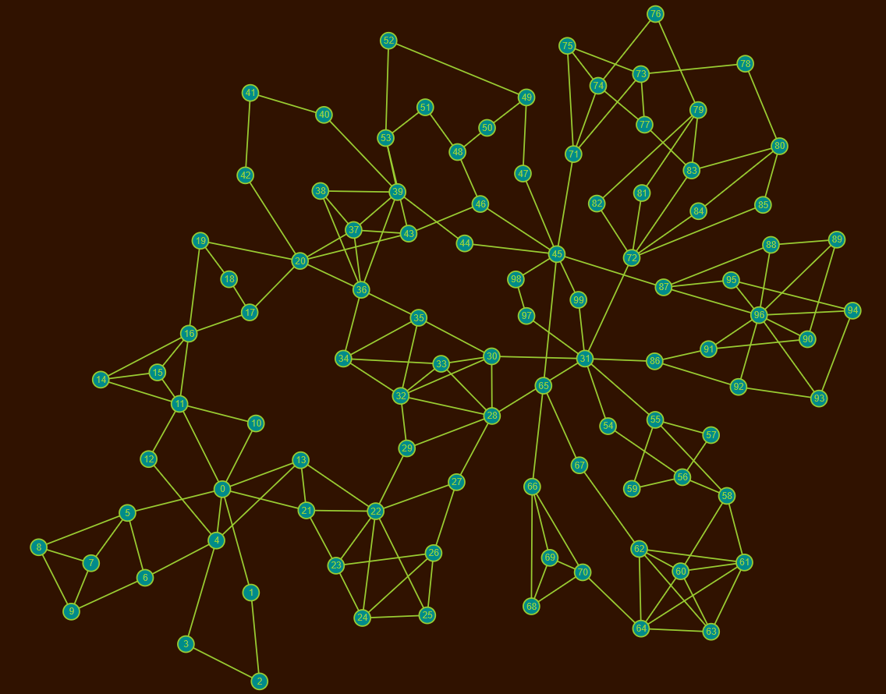
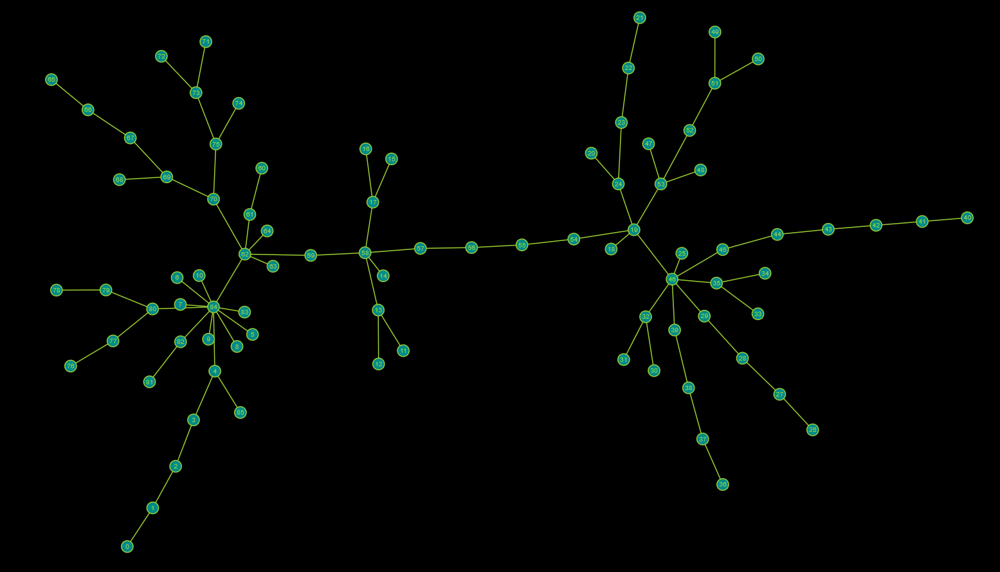
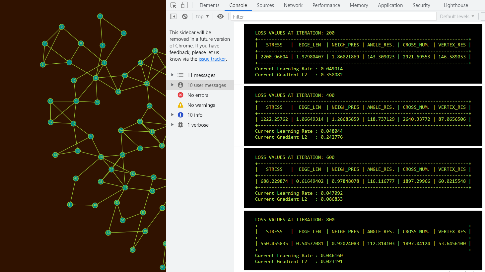

# Network-viewer-via-Adam-Algorithm
Software per il dispiegamento automatico di una rete su schermo. L'obiettivo è cercare di produrre rappresentazioni geometriche di un grafo che siano gradevoli alla vista umana.

Supponendo di avere a disposizione una fotografia di una raffigurazione geometrica della rete (in cui ogni nodo è rappresentato da un vettore nel piano (x,y)) è possibile fare delle osservazioni inerenti a multipli aspetti grafici del disegno (lunghezze degli archi, angoli tra gli spigoli, occlusioni, rispetto del vicinato etc etc).
Con queste osservazioni si può ottenere una misura della qualità del disegno corrente, comparando i parametri misurati con dei parametri che un disegno ideale dovrebbe rispettare, formulando quindi delle funzioni di costo.

Queste funzioni di costo saranno funzioni dipendenti dalle posizioni (x,y) di tutti i nodi della rete. Minimizzando queste funzioni rispetto allo spazio dei pesi (ovvero in questo caso rispetto alle coordinate dei vertici) si ottiene uno spostamento dei nodi
dettato dalle derivate parziali rispetto a ogni variabile.

Combinando le derivate parziali insieme al Momentum e al RMSProp si ottiene l'algoritmo Adam (Adaptive Moment Estimation), che incrementa notevolmente la velocità di convergenza del disegno a un minimo, aumentando anche le probabilità di non incorrere in pessimi minimi locali.

I papers di riferimento sono:

   Graph Drawing Via Gradient Descent: https://arxiv.org/pdf/2008.05584.pdf
   
   Adam: A Method for Stochastic Optimization: https://arxiv.org/pdf/1412.6980.pdf

   

- Nel file *header.js* è possibile fare tuning del sistema, cambiando i coefficienti di miscelazione dei vari criteri estetici, le proprietà grafiche del disegno.
- Nel file *examples.js* sono presenti degli esempi di reti (cambiare il nome della variabile EXAMPLE(I) nell'index.html)

I criteri estetici implementati sono:
  - Stress: Cercare di rendere simili le distanze euclidee e le distanze topologiche tra i nodi.
  - Ideal Edge Length: Cercare di rendere le lunghezze degli archi simili a un set di lunghezze ideali L
  - Neighbourhood Preservation: Far si che ogni nodo abbia come vicini i nodi a lui adiacenti
  - Angle Resolution: Regolarizzare gli angoli tra gli spigoli in modo da evitare occlusioni di archi.
  - Vertex Resolution: Fissare una distanza minima tra i nodi in modo da evitare occlusioni di nodi.
  
  Nella Console si possono osservare le variazioni nel tempo dei valori delle funzioni di costo durante l'esecuzione dell'algoritmo:
  
  
  
  Per migliorare l'esperienza utente sono state implementate le seguenti funzionalità d'interazione:
  - zoomIn/zoomOut del disegno, 
  - DragAndDrop dello sfondo per la traslazione dell'intera rete 
  - DragAndDrop dei nodi per interagire con il movimento dei nodi
